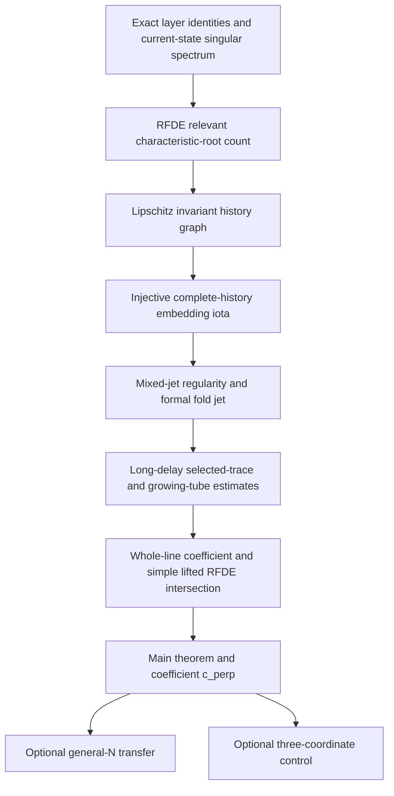

# Flagship research design: transverse delay organization and a canard root

Status: **proof-first design, 2026-08-22.** This document controls the
submission scope until the main theorem is proved. The broader finite-
network transfer and frequency--amplitude--safety program remains in the
repository, but it enters the paper only through the promotion gates below.

## 1. The paper in one sentence

Two delayed FitzHugh--Nagumo systems can have the same total delayed gain and
the same delay measure seen by the critical projection, yet have different
local canard thresholds because delay forcing enters a stable transverse
mode and returns through the nonlinearity.

The paper must prove this statement for one fixed two-module RFDE. It must not
replace the missing proof by assuming a full Fredholm theory and then applying
the implicit-function theorem.

## 2. Nearest result and the new mathematical object

[Zhang et al. (2026)](https://doi.org/10.1137/24M1696548) compute high-order
canard data for one weakly delayed van der Pol oscillator. In their
normalization, \(J=\varepsilon K\),
\(\tau=\Theta/\sqrt\varepsilon\), and \(a\) is the scalar van der Pol
unfolding parameter. Their coefficient is the required calibration:

\[
 a_c=1-\frac18\varepsilon
 +\frac{K\Theta}{8}\varepsilon^{3/2}+\cdots .
\tag{1}
\]

Equation (1), the weak-feedback scaling, and the nonlinear time-transformation
calculation are prior work, not contributions of this paper. The new object is
the derivative of a geometric RFDE canard root in a direction that is
invisible to the critical projected delay measure.

No theorem is imported from the scalar van der Pol equation into the vector
FitzHugh--Nagumo RFDE. The parameter-regular invariant-history reduction, the
transverse return, and the history-level canard intersection and remainder are
new proof obligations.

The intended distinction is therefore about the result, not merely the
method:

- the published scalar problem computes a threshold inside one delayed
  oscillator;
- the target theorem aims to prove that a transverse delay organization
  changes the threshold even when the scalar delayed data are held fixed.

## 3. Base RFDE and fixed-data contract

The submission core uses exactly two voltage--recovery modules and two fixed
scaled delay atoms

\[
 0<\theta_0<\theta_1\leq\theta_{\max},
 \qquad \tau_k=\theta_k/\delta,
 \qquad \delta=\sqrt\varepsilon.
\tag{2}
\]

Let \(v=(v_1,v_2)^\top\), \(w=(w_1,w_2)^\top\), and
\(\sigma=\sqrt{3/2}\). In physical fast time, the target RFDE to be
algebraically re-audited in Phase I is

\[
\boxed{
\begin{aligned}
 \dot v(t)={}&F(v(t),w(t))
 +\varepsilon K\left[
 Bv(t)-C_0^\eta v(t-\tau_0)-C_1^\eta v(t-\tau_1)
 \right],\\
 \dot w(t)={}&\varepsilon
 \begin{pmatrix}v_1(t)-\sigma-\mu\\ v_2(t)-2\mu\end{pmatrix}
 -D_wP_\perp(w(t)-w_*),
\end{aligned}}
\tag{M}
\]

where

\[
 F(v,w)=
 \begin{pmatrix}
 v_1-v_1^3/3-w_1+(v_2-v_1)/2\\
 v_2-v_2^3/3-w_2+2(v_1-v_2)
 \end{pmatrix},
 \qquad
 v_*=\begin{pmatrix}\sigma\\0\end{pmatrix},
 \quad
 w_*=\begin{pmatrix}0\\2\sigma\end{pmatrix}.
\]

The positive two-layer family from
[two-module-moment-counterexample.md](two-module-moment-counterexample.md) is

\[
\begin{gathered}
 C_0=\begin{pmatrix}1/6&1/12\\1/6&1/4\end{pmatrix},
 \qquad
 C_1=\begin{pmatrix}1/3&1/6\\1/2&5/12\end{pmatrix},\\
 T=\begin{pmatrix}1&0\\-2&0\end{pmatrix},
 \qquad
 C_0^\eta=C_0+\eta T,
 \qquad
 C_1^\eta=C_1-\eta T,
 \qquad
 B=C_0+C_1.
\end{gathered}
\tag{3}
\]

Thus the delayed term has the source-history form

\[
 \mathcal H_\eta[v_t]
 =Bv(t)-C_0^\eta v(t-\theta_0/\delta)
       -C_1^\eta v(t-\theta_1/\delta).
\tag{4}
\]

Equivalently, its operator-valued delay measure is

\[
 \mathbb B_\eta(d\theta)
 =C_0^\eta\delta_{\theta_0}(d\theta)
 +C_1^\eta\delta_{\theta_1}(d\theta).
\tag{4a}
\]

The final theorem model retains two recovery variables and adds the fixed,
non-actuated recovery coupling

\[
 -D_wP_\perp(w-w_*),
 \qquad D_w>0,
\tag{5}
\]

where

\[
 r=\begin{pmatrix}1\\2\end{pmatrix},
 \qquad
 \ell=\begin{pmatrix}1/2\\1/4\end{pmatrix},
 \qquad
 P_\perp=I-r\ell^\top.
\]

This fixed \(O(1)\) physical-time coupling vanishes on the critical recovery
line and removes the extra transverse recovery center. It changes
off-critical recovery dynamics and must be named as part of the model, not
hidden as a control input. Fix once and for all

\[
 K\neq0,\qquad D_w>0,\qquad
 0<\theta_0<\theta_1,
 \qquad 0<\bar\eta<1/20.
\]

For \(|\eta|\leq\bar\eta\), both delayed layer matrices are positive. Every
estimate constant in the base theorem may depend on these fixed data, on the
selected outer slow manifolds below, and on the gap normalization, but not on
\(\delta\) or \(\eta\).

The proof is formulated after the fold blow-up and time scaling
\(s=\delta t\), so the history interval is the fixed interval
\([ -\theta_1,0]\). Fix the attracting and repelling Fenichel slow manifolds
on outer sections in physical/K1 coordinates; these selections define which
maximal canard is being followed. With
\(X=\delta^{-1}\ell^\top(v-v_*)\), use \(X=0\) only as the matching/gap
section, with a phase condition placing the match at \(s=0\). For the
long-delay proof, the auxiliary K2 transition sections recede as
\(s=\pm S_\delta\), where
\(S_\delta=\sqrt{2p\log(1/\delta)}\); they are not fixed entry/exit sections
defining a different finite-tube root. The intended object is an injective
history embedding

\[
 \iota_{\delta,\eta}:U\subset\mathbb R^2
 \longrightarrow C([ -\theta_1,0],\mathbb R^4)
\]

whose image contains the selected attracting and repelling local slow
histories. Their reduced scalar matching gap on \(X=0\) is denoted
\(d(\mu,\delta,\eta)\); a selected matching parameter is a zero of \(d\).
Gate D must prove that this reduced zero is equivalent to equality of the
embedded complete histories before it is called an RFDE maximal canard. The
exact orientation, fibers, and gap normalization must be stated before the
target theorem is promoted to a result.

The following are fixed for version 1:

- \(N=2\), with two fixed modules rather than arbitrary module sizes;
- two fixed delay atoms rather than moving delay measures;
- the fixed \(K,D_w,\theta_0,\theta_1\) and positivity radius above;
- one local right-fold canard, fixed outer Fenichel selections, and the
  matching section \(X=0\);
- the geometric threshold is a local slow-history intersection, not a global
  spike detector.

General \(N\), freely moving delay support, arbitrary node heterogeneity, and
global pulse events are not part of the base theorem.

## 4. Exact invariants and the candidate coefficient

The family (3) is designed so that

\[
 C_0^\eta+C_1^\eta=B
\tag{6}
\]

and the critical projected delay measure

\[
 \ell^\top\mathbb B_\eta(d\theta)r
 =\frac13\delta_{\theta_0}(d\theta)
  +\frac23\delta_{\theta_1}(d\theta)
\tag{7}
\]

are independent of \(\eta\), while

\[
 P_\perp\mathbb B_\eta(d\theta)r
 =\eta q\left[
   \delta_{\theta_0}(d\theta)-\delta_{\theta_1}(d\theta)
  \right],
 \qquad q=Tr=\begin{pmatrix}1\\-2\end{pmatrix},
\tag{8}
\]

is not. These are exact finite-dimensional identities.

At \(\varepsilon=0\), \(\mu=0\), and \((v,w)=(v_*,w_*)\), the current-state
Jacobian has

\[
 \det(zI-J_0)=z^2(z+2)(z+D_w),
\tag{8a}
\]

so its generalized center is exactly the collective length-two Jordan chain.
This finite-dimensional identity alone does not prove an RFDE spectral gap.
For the final scaled equation, however, the Rouché--Schur argument in
[rfde-relevant-spectrum.md](rfde-relevant-spectrum.md) proves that exactly two
simple characteristic roots lie in the declared relevant half-plane and that
all remaining roots are uniformly separated to the left.

Let

\[
 \alpha=\frac12\sqrt{\frac32}.
\tag{9}
\]

The formal compact-tube invariance recursion yields the local mixed
vector-field jet

\[
 \partial_\eta q_{2,X}(\gamma_0(s))
 =-\frac{K(\theta_0-\theta_1)}{4\alpha}s.
\tag{9a}
\]

If the selected-tail estimates justify the whole-line Gaussian pairing, the
conditional splitting corollary gives

\[
 \partial_\eta\mu_c(\delta,0)
 =\frac{K(\theta_0-\theta_1)}{4\alpha}\delta^3
 +O(\delta^4).
\tag{10}
\]

Equation (9a) is the exact symbolic coefficient of the formal invariance
recursion; its remainder control depends on the mixed-regularity lemma.
Equation (10) is not a fixed-tube theorem. A fixed tube cannot determine the
whole-line Melnikov coefficient because omitted endpoint and tail terms occur
at the same order. The three uniform estimates
isolated in [k1-tail-compatibility.md](k1-tail-compatibility.md) are precisely
what would promote the conditional calculation in
[reduced-canard-root.md](reduced-canard-root.md) to the selected long-delay
RFDE maximal-canard root.

## 5. Minimum theorem target for the base paper

The theorem should have the following form.

> **Main theorem -- transverse delay contribution.** There exist
> \(\delta_0,\eta_*,C>0\), with \(\eta_*\leq\bar\eta\), such that, for
> \(0<\delta\leq\delta_0\) and \(|\eta|\leq\eta_*\), the two-module RFDE
> (M) has a unique selected local matching root
> \(\mu_c(\delta,\eta)\) among roots for which
> \(\nu=\mu/\delta^2\) lies in a fixed neighborhood of
> \(\nu_0=-11/(24\alpha)\). The corresponding reduced attracting and repelling
> histories have the same image under \(\iota_{\delta,\eta}\), so this root is
> the unique selected local RFDE maximal-canard parameter. Moreover, for the
> coefficient \(c_\perp\) obtained
> from the actual RFDE reduction,
> \[
> \left|
> \mu_c(\delta,\eta)-\mu_c(\delta,0)
> -c_\perp K\eta(\theta_0-\theta_1)\delta^3
> \right|
> \leq C\left(\delta^4|\eta|+\delta^3\eta^2\right).
> \tag{11}
> \]
> The total gain (6) and projected delay measure (7) are independent of
> \(\eta\), whereas \(c_\perp\neq0\).

The whole-line conditional calculation gives the candidate
\(c_\perp=1/(4\alpha)\). The paper may state it as the coefficient of the
selected RFDE root only after the long-delay tail/matching estimates close.
If the root is called geometric, its value
must be shown independent of admissible section and gap conventions. Every
uniformity statement in (11) must be proved rather than supplied by a
numerical experiment.

## 6. Shortest proof route

Each supporting result has one mathematical job.

| Result | Object that must be constructed or estimated | Obstruction removed | Current status |
|---|---|---|---|
| Lemma 1 | Identities (6)--(8), fold nondegeneracy, positivity, exact blow-up, and the repaired singular characteristic polynomial | Excludes a disguised scalar-moment change and removes the extra recovery center | Proved and symbolically tested for (M) |
| Proposition 2 | Exactly two simple relevant RFDE roots and a uniform complementary characteristic-root gap | Counts the critical characteristic directions without discarding high-frequency roots | Proved by Rouché--Schur root counting; phase-space projector bounds are not claimed |
| Proposition 3 | A bounded Lipschitz invariant history graph and injective complete-history map on a fixed compact tube | Infinite-dimensional history and backward-extension problem | Lipschitz fixed point proved by special-flow contraction with cutoff |
| Lemma 4 | Finite-order mixed \((u,\delta,\eta)\) regularity and a uniform Taylor remainder for the graph | Converts the formal invariance recursion into a coefficient of the actual graph | Open; fiber-contraction scheme written, common jet spaces/operators still required |
| Proposition 5 | The reduced vector-field jet through the order that can produce an \(\eta\delta^3\) root shift | Identifies the local history-embedding return before the global pairing | Formal coefficient (9a) uniquely determined and symbolically checked; remainder control depends on Lemma 4 |
| Proposition 6 | Selected one-sided trace bounds, growing-tube graph remainder, normalized gap derivatives, and the whole-line pairing | Determines whether the local jet produces the candidate coefficient for the physical long-delay traces | Open long-delay theorem gate |
| Lift lemma | Equivalence between a reduced intersection inside the injective graph and equality of the embedded complete histories | Prevents a reduced event from being mislabeled as an RFDE history intersection | Proved conditionally on the selected curves belonging to the graph; global membership follows only after Proposition 6 |

The first paper should construct the matching gap in coordinates on
\(\mathcal M_{\delta,\eta}\) and use the injective history embedding to prove
the corresponding complete-history intersection. It should not begin by
postulating an arbitrary \(2N\)-state Fredholm trace pair.

The broader contracts in `scope-and-theorems.md` and
`full-network-lin-operator.md` are therefore promotion specifications, not
assumptions available to the base proof.

## 7. Stop/go gates

### Gate A -- relevant spectrum

**Passed for the frozen-equilibrium characteristic-root count.** The final
scaled RFDE has exactly two simple relevant roots and a uniform complementary
root gap. Fixed-contour characteristic-matrix inverses are bounded. A
phase-space Riesz-projector bound and a nonautonomous Green-operator estimate
are not claimed; the special-flow graph construction does not use them.

### Gate B -- parameter-regular invariant history manifold

**Partially passed on every fixed compact fold tube.** The contraction proves
a unique bounded Lipschitz history graph and an injective complete-history
map. The finite-order mixed-jet regularity and uniform Taylor remainder remain
an explicit lemma target; the present fiber argument has not yet specified
all common jet spaces and highest-order operator estimates.

### Gate C -- coefficient

**Formal local jet fixed; graph coefficient and root coefficient open.** The
invariance recursion uniquely gives (9a), and symbolic division checks it.
It becomes a remainder-controlled jet of the actual history graph only after
Gate B's mixed-regularity lemma closes. The value \(1/(4\alpha)\) then requires
a whole-line Gaussian pairing; a fixed tube cannot certify that pairing.

### Gate D -- geometric canard

**Open for the long-delay model.** Prove:

1. the selected one-sided trace tame bound;
2. the growing-tube invariant-graph remainder;
3. the normalized gap and parameter-derivative bounds.

The logarithmic-section suppression lemma then closes the simple root,
uniform remainder, and history-lift equivalence. Until all three estimates are
proved, use “conditional reduced connection root,” not “proved RFDE
maximal-canard threshold.”

### Model-selection gate

Before continuing Gate D, choose between:

- the current long-delay model \(\tau_k=\theta_k/\delta\), whose
  \(O(\delta^3)\) coefficient requires new logarithmic-tail analysis; or
- fixed physical delays \(\tau_k=O(1)\), which restore the standard \(K_1\)
  route but move the first transverse term to \(O(\delta^4)\).

The first route is more novel and riskier. The second is the recommended
proof-completion route if the priority is one defensible paper rather than a
new long-delay tail theorem.

### Gate E -- promotion to general networks

Only after Gate D passes, attempt the full finite-\(N\) direct-sum Lin theorem.
It enters this paper only if it supplies a model-specific \(N\)-uniform inverse
bound and a computable structural functional without introducing a second
unproved geometry.

### Gate F -- control corollary

The frequency--amplitude--safety result enters this paper only if the periodic
branch, extrema regularity, and a positive singular-value lower bound follow
from one short additional section. A plotted determinant is insufficient. If
the result requires an independent phase--amplitude theory, omit it from the
title, abstract, and main claims.

## 8. Claim hierarchy

| Level | Permitted claim | Evidence required |
|---|---|---|
| Exact | Final model, fixed total gain, fixed projected delay measure, algebraic transverse forcing, exact blow-up, singular Jordan chain, and characteristic determinant | Symbolic and hand proof for (M) |
| Proved analytic | Relevant-root count, bounded Lipschitz cutoff history graph, and conditional injective history lift | Rouché--Schur estimate and base special-flow contraction |
| Formal/local | Mixed vector-field jet (9a) | Exact invariance recursion and symbolic division audit |
| Proof pending | Finite-order mixed regularity of the actual graph | Fully specified jet fiber and uniform Taylor-remainder proof |
| Conditional | Whole-line coefficient \(1/(4\alpha)\) and long-delay root expansion (11) | Mixed-regularity lemma plus the three explicitly stated tail/matching estimates and conditional splitting argument |
| Theorem | Selected RFDE canard root and uniform remainder (11) | Close Gate D and prove the selected curves lie in the history graph through the logarithmic matching region |
| Numerical | Convergence of normalized finite-section threshold differences | Reproducible method-of-steps refinements with history/section dependence reported |
| Excluded | Global spiking threshold, arbitrary finite network, or independent three-coordinate assignment | Not inferred from the local theorem |

## 9. Paper architecture

1. **Introduction and main theorem.** Present the two delay organizations,
   state (11), and explain the boundary with Zhang et al. (2026).
2. **The fixed two-module RFDE.** Give the equation, exact invariants, fold
   geometry, and repaired singular spectrum.
3. **Nonlocal invariant history graph.** Construct
   \(\mathcal M_{\delta,\eta}\), its injective complete-history embedding, and
   mixed parameter jets on the compact fold tube.
4. **The reduced fold jet.** Calculate the transverse range response and its
   nonlinear return to the critical equation.
5. **The canard intersection.** For the long-delay route, prove the selected
   trace, growing-tube, and logarithmic matching estimates; for the fixed-delay
   route, replace this with the regular \(K_1\) third-order splitting. Then
   prove the simple root, remainder, history lift, and main theorem.
6. **Numerical check.** Test only the normalized limit
   \[
   \frac{\mu_c(\delta,\eta)-\mu_c(\delta,0)}
        {K\eta(\theta_0-\theta_1)\delta^3}
   \longrightarrow c_\perp.
   \tag{12}
   \]
7. **Discussion.** State the precise promotion conditions for general
   networks and control.

Move mechanical matrix calculations, repeated jet coefficients, solver
configuration, and secondary convergence tables to appendices. Keep the
invariant-history construction, transverse return mechanism, and canard root
argument in the main text.

## 10. Figure plan

Use at most two essential figures in the base paper.

1. **Mechanism schematic:** delay-layer redistribution \(\to\) stable
   transverse response \(\to\) nonlinear return \(\to\) canard-root shift.
   It must be labelled as a schematic, not a phase portrait proof.
2. **Computed asymptotic test:** the normalized quantity in (12), with
   tolerance and maximum-step refinements, against \(\delta\).

If Gate E passes, add one full/reduced structural-root displacement figure.
If Gate F passes, replace rather than supplement a figure with the certified
control singular-value region.

## 11. Work plan

### Phase I -- close the model and spectrum (completed)

- write one final RFDE combining the positive two-layer family and the fixed
  recovery coupling;
- rerun every exact equilibrium, projection, positivity, and spectrum check;
- prove or falsify Gate A before adding simulations.

### Phase II -- construct the compact-tube invariant geometry (partial)

- prove the special-flow graph by contraction rather than applying a singular
  RFDE center-manifold theorem as a black box;
- construct the injective complete-history embedding;
- complete the common mixed-jet fiber and uniform compact-tube Taylor
  remainder.

### Phase III -- formal local jet (completed) and model selection (current)

- retain the symbolically fixed compact-tube jet and conditional whole-line
  splitting law;
- choose long physical delays or fixed physical delays;
- close the corresponding tail/\(K_1\) estimates before promoting (11).

### Phase IV -- validate and decide promotion

- retain the implemented method-of-steps convergence diagnostic as
  falsification evidence, not proof;
- audit every claim as exact, formal, proved, or numerical;
- attempt Gates E and F only after the main theorem is complete.

## 12. Submission rule

The abstract leads with (11) and the fixed-projected-delay-measure/changing-
transverse-organization mechanism. The
paper does not lead with a generic implicit-function formula, a scalar
\(K\Theta/8\) coefficient, or the number of model components. General network
transfer and three-coordinate control appear as main claims only after their
promotion gates have been passed.

Execution is tracked in
[the base-theorem issue](https://github.com/h-lu/canard-aware-network-control/issues/10)
and
[the flagship epic](https://github.com/h-lu/canard-aware-network-control/issues/9).
