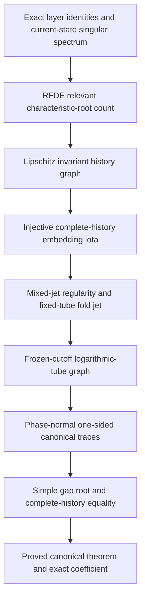

# Flagship research design: transverse delay organization and a canonical history connection

Status: **canonical local theorem proved and independently audited,
2026-08-22.**
This document controls the submission scope. The base theorem statement is a
canonical local history-connection theorem, not a theorem about an arbitrary
physical outer selection. Identification with a fixed physical outer Fenichel
selection is a separate conditional corollary. The broader
finite-network transfer and frequency--amplitude--safety program remains
frozen outside this paper.

## 1. The paper in one sentence

Two delayed FitzHugh--Nagumo systems can have the same total delayed gain and
the same delay measure seen by the critical projection, yet have different
canonical local history-connection roots because delay forcing enters a stable
transverse mode and returns through the nonlinearity.

The paper proves this statement for one fixed two-module RFDE through an exact
invariant-history graph, canonical one-sided traces, and a simple lifted
history intersection. It does not replace these constructions by assuming a
full Fredholm theory, and it does not relabel an unspecified physical outer
maximal canard as the canonical root.

## 2. Nearest result and the new mathematical object

[Zhang et al. (2026)](https://doi.org/10.1137/24M1696548) compute high-order
canard data for one weakly delayed van der Pol oscillator. In their
normalization, \(J=\varepsilon K\),
\(\tau=\Theta/\sqrt\varepsilon\), and \(a\) is the scalar van der Pol
unfolding parameter. Their coefficient is the required calibration:

\[
 a_c=1-\frac18\varepsilon
 +\frac{K\Theta}{8}\varepsilon^{3/2}+\cdots .
\tag{1}
\]

Equation (1), the weak-feedback scaling, and the nonlinear time-transformation
calculation are prior work, not contributions of this paper. The new object is
the derivative of a canonical local RFDE history-connection root in a
direction that is invisible to the critical projected delay measure.

No theorem is imported from the scalar van der Pol equation into the vector
FitzHugh--Nagumo RFDE. The parameter-regular invariant-history reduction, the
transverse return, the one-sided phase-normal selection, and the history-level
intersection and remainder are proved here by a different construction.

The intended distinction is therefore about the result, not merely the
method:

- the published scalar problem computes a threshold inside one delayed
  oscillator;
- the present theorem proves that a transverse
  delay organization changes the canonical local history root even when the
  scalar delayed data are held fixed.

## 3. Base RFDE and fixed-data contract

The submission core uses exactly two voltage--recovery modules and two fixed
scaled delay atoms

\[
 0<\theta_0<\theta_1\leq\theta_{\max},
 \qquad \tau_k=\theta_k/\delta,
 \qquad \delta=\sqrt\varepsilon.
\tag{2}
\]

Let \(v=(v_1,v_2)^\top\), \(w=(w_1,w_2)^\top\), and
\(\sigma=\sqrt{3/2}\). In physical fast time, the audited RFDE is

\[
\boxed{
\begin{aligned}
 \dot v(t)={}&F(v(t),w(t))
 +\varepsilon K\left[
 Bv(t)-C_0^\eta v(t-\tau_0)-C_1^\eta v(t-\tau_1)
 \right],\\
 \dot w(t)={}&\varepsilon
 \begin{pmatrix}v_1(t)-\sigma-\mu\\ v_2(t)-2\mu\end{pmatrix}
 -D_wP_\perp(w(t)-w_*),
\end{aligned}}
\tag{M}
\]

where

\[
 F(v,w)=
 \begin{pmatrix}
 v_1-v_1^3/3-w_1+(v_2-v_1)/2\\
 v_2-v_2^3/3-w_2+2(v_1-v_2)
 \end{pmatrix},
 \qquad
 v_*=\begin{pmatrix}\sigma\\0\end{pmatrix},
 \quad
 w_*=\begin{pmatrix}0\\2\sigma\end{pmatrix}.
\]

The positive two-layer family from
[two-module-moment-counterexample.md](two-module-moment-counterexample.md) is

\[
\begin{gathered}
 C_0=\begin{pmatrix}1/6&1/12\\1/6&1/4\end{pmatrix},
 \qquad
 C_1=\begin{pmatrix}1/3&1/6\\1/2&5/12\end{pmatrix},\\
 T=\begin{pmatrix}1&0\\-2&0\end{pmatrix},
 \qquad
 C_0^\eta=C_0+\eta T,
 \qquad
 C_1^\eta=C_1-\eta T,
 \qquad
 B=C_0+C_1.
\end{gathered}
\tag{3}
\]

Thus the delayed term has the source-history form

\[
 \mathcal H_\eta[v_t]
 =Bv(t)-C_0^\eta v(t-\theta_0/\delta)
       -C_1^\eta v(t-\theta_1/\delta).
\tag{4}
\]

Equivalently, its operator-valued delay measure is

\[
 \mathbb B_\eta(d\theta)
 =C_0^\eta\delta_{\theta_0}(d\theta)
 +C_1^\eta\delta_{\theta_1}(d\theta).
\tag{4a}
\]

The final theorem model retains two recovery variables and adds the fixed,
non-actuated recovery coupling

\[
 -D_wP_\perp(w-w_*),
 \qquad D_w>0,
\tag{5}
\]

where

\[
 r=\begin{pmatrix}1\\2\end{pmatrix},
 \qquad
 \ell=\begin{pmatrix}1/2\\1/4\end{pmatrix},
 \qquad
 P_\perp=I-r\ell^\top.
\]

This fixed \(O(1)\) physical-time coupling vanishes on the critical recovery
line and removes the extra transverse recovery center. It changes
off-critical recovery dynamics and must be named as part of the model, not
hidden as a control input. Fix once and for all

\[
 K\neq0,\qquad D_w>0,\qquad
 0<\theta_0<\theta_1,
 \qquad 0<\bar\eta<1/20.
\]

For \(|\eta|\leq\bar\eta\), both delayed layer matrices are positive. Every
estimate constant in the base theorem may depend on these fixed data, on the
canonical preparation, and on the gap normalization, but not on \(\delta\) or
\(\eta\).

The proof is formulated after the fold blow-up and time scaling
\(s=\delta t\), so the history interval is the fixed interval
\([-\theta_1,0]\). Let
\[
 S_\delta=\sqrt{2p\log(1/\delta)}
\]
for one sufficiently large fixed \(p\). A target-dependent cutoff is frozen
before differentiating a dummy amplitude, and the reduced planar field is
extended canonically so that it equals the singular field \(q_0\) on the two
prepared tails. On those tails impose the exact singular level condition
\(\mathscr H=0\); impose the common phase \(X=0\) at \(s=0\). The one-sided
Green construction then selects unique attracting and repelling traces. Only
their retained central pieces, together with all required delayed
backtracks, are asserted to lie in the exact uncut history graph. No prepared
tail point outside that retained set is called a physical RFDE solution.

The relevant exact object is the injective history embedding

\[
 \iota_{\delta,\eta}:U\subset\mathbb R^2
 \longrightarrow C([ -\theta_1,0],\mathbb R^4)
\]

whose image contains both retained central traces. The canonically normalized
gap is
\[
 D(\delta,\nu,\eta)=\frac{2}{\alpha e}
 \left[\mathscr H(z^a_{\delta,\nu,\eta}(0))
       -\mathscr H(z^r_{\delta,\nu,\eta}(0))\right].
\]
At \(X=0\), transverse nondegeneracy gives \(D=0\) if and only if the two
planar traces meet. Planar uniqueness and injectivity of
\(\iota_{\delta,\eta}\) then identify this zero with equality of the two
retained complete RFDE histories.

An arbitrarily selected physical outer Fenichel family is a different
object. It is connected to the canonical root only conditionally: the
selection rule must enter the retained graph and supply parameter-coherent
full-history boundary residuals and rectangular \(C_\nu^1C_\eta^2\) jets with
the tame bounds in
[canonical-long-delay-theorem.md](canonical-long-delay-theorem.md).

The following are fixed for version 1:

- \(N=2\), with two fixed modules rather than arbitrary module sizes;
- two fixed delay atoms rather than moving delay measures;
- the fixed \(K,D_w,\theta_0,\theta_1\) and positivity radius above;
- one canonical local right-fold history connection and the matching section
  \(X=0\);
- a physical outer selection only through the explicitly conditional
  boundary-jet corollary;
- a local history intersection, not a global spike detector.

General \(N\), freely moving delay support, arbitrary node heterogeneity, and
global pulse events are not part of the base theorem.

## 4. Exact invariants and the canonical coefficient

The family (3) is designed so that

\[
 C_0^\eta+C_1^\eta=B
\tag{6}
\]

and the critical projected delay measure

\[
 \ell^\top\mathbb B_\eta(d\theta)r
 =\frac13\delta_{\theta_0}(d\theta)
  +\frac23\delta_{\theta_1}(d\theta)
\tag{7}
\]

are independent of \(\eta\), while

\[
 P_\perp\mathbb B_\eta(d\theta)r
 =\eta q\left[
   \delta_{\theta_0}(d\theta)-\delta_{\theta_1}(d\theta)
  \right],
 \qquad q=Tr=\begin{pmatrix}1\\-2\end{pmatrix},
\tag{8}
\]

is not. These are exact finite-dimensional identities.

At \(\varepsilon=0\), \(\mu=0\), and \((v,w)=(v_*,w_*)\), the current-state
Jacobian has

\[
 \det(zI-J_0)=z^2(z+2)(z+D_w),
\tag{8a}
\]

so its generalized center is exactly the collective length-two Jordan chain.
This finite-dimensional identity alone does not prove an RFDE spectral gap.
For the final scaled equation, however, the Rouché--Schur argument in
[rfde-relevant-spectrum.md](rfde-relevant-spectrum.md) proves that exactly two
simple characteristic roots lie in the declared relevant half-plane and that
all remaining roots are uniformly separated to the left.

Let

\[
 \alpha=\frac12\sqrt{\frac32}.
\tag{9}
\]

The compact-tube invariance recursion yields the local mixed vector-field jet

\[
 \partial_\eta q_{2,X}(\gamma_0(s))
 =-\frac{K(\theta_0-\theta_1)}{4\alpha}s.
\tag{9a}
\]

The growing-tube and canonical one-sided Green constructions justify the
Gaussian pairing and give, at \(\eta=0\),

\[
 \partial_\eta\mu_c(\delta,0)
 =\frac{K(\theta_0-\theta_1)}{4\alpha}\delta^3
 +O(\delta^4).
\tag{10}
\]

Equation (9a) is the exact symbolic coefficient of the invariance recursion.
The finite-scale proof in
[mixed-jet-graph-proof.md](mixed-jet-graph-proof.md) promotes it to a Taylor
coefficient of the actual graph on every fixed cutoff tube, with the required
remainder control. The logarithmic-tube theorem in
[growing-tube-graph-proof.md](growing-tube-graph-proof.md) extends the actual
graph jet to the required shrinking flow hull. The explicit phase-normal
operators in
[green-phase-selected-traces.md](green-phase-selected-traces.md) select the
one-sided traces and suppress the normally growing mode. Together with the
trace-to-gap calculation, these components prove (10) and the full root law
for the canonical history connection. The assembled theorem and independent
falsification record are in
[canonical-long-delay-theorem.md](canonical-long-delay-theorem.md).

Equation (10) is not a theorem for an arbitrary physical outer selection.
The exact physical equations and branch jets are recorded in
[outer-modal-algebra.md](outer-modal-algebra.md), but transfer of (10) to a
chosen physical Fenichel family remains conditional on parameter-coherent
full-history boundary jets. The physical modal identities are regenerated by
[outer_modal_audit.py](../src/canard_control/outer_modal_audit.py) and checked
by [test_outer_modal_audit.py](../tests/test_outer_modal_audit.py). The
phase-normal identities are implemented in
[green_phase.py](../src/canard_control/green_phase.py) and checked by
[test_green_phase.py](../tests/test_green_phase.py); these executable checks
support the exact algebra but do not replace the analytic estimates.

## 5. Base theorem and conditional physical comparison

The proof components establish the following statement.

> **Main theorem -- canonical local history-connection root.** For every
> fixed admissible preparation datum \(\mathcal P\), there exist
> \(\delta_0,\eta_*,C>0\), with \(\eta_*\leq\bar\eta\), such that, for
> \(0<\delta\leq\delta_0\) and \(|\eta|\leq\eta_*\), the two-module RFDE
> (M), with the canonical prepared-tail and phase convention, has a unique
> local matching root \(\mu_{c,\mathcal P}(\delta,\eta)\) among roots for which
> \(\nu=\mu/\delta^2\) lies in a fixed neighborhood of
> \(\nu_0=-11/(24\alpha)\). At this root the retained attracting and repelling
> traces have equal images under \(\iota_{\delta,\eta}\), hence are the same
> complete retained RFDE history. Moreover,
> \[
> \boxed{
> \mu_{c,\mathcal P}(\delta,\eta)-\mu_{c,\mathcal P}(\delta,0)
> =\frac{K(\theta_0-\theta_1)}{4\alpha}\delta^3\eta
> +O(\delta^4|\eta|+\delta^3\eta^2).}
> \tag{11}
> \]
> The remainder is uniform on the fixed data box and over admissible
> preparations with the common finite derivative bounds. The total gain (6) and
> projected delay measure (7) are independent of \(\eta\), whereas the
> displayed coefficient is nonzero.

Since \(4\alpha=\sqrt6\), the leading coefficient is
\(K(\theta_0-\theta_1)/\sqrt6\). The theorem is local and canonical: it does
not assert that every admissible section, every outer slow manifold, or every
global pulse threshold produces the same root.

The separate physical comparison is conditional. If a physical
attracting/repelling outer history family is chosen by a fixed,
parameter-coherent rule, enters the retained graph, and has full-history
boundary residuals and rectangular \(C_\nu^1C_\eta^2\) jets bounded by the
tame estimate stated in the canonical theorem note, then its gap differs from
the canonical gap by \(O(\delta^{p-o(1)})\). For sufficiently large fixed
\(p\), its root therefore has the same leading coefficient. Those boundary
jet hypotheses are not yet proved for an arbitrary physical outer Fenichel
selection.

## 6. Shortest proof route

Each supporting result has one mathematical job.

| Result | Object that must be constructed or estimated | Obstruction removed | Current status |
|---|---|---|---|
| Lemma 1 | Identities (6)--(8), fold nondegeneracy, positivity, exact blow-up, and the repaired singular characteristic polynomial | Excludes a disguised scalar-moment change and removes the extra recovery center | Proved and symbolically tested for (M) |
| Proposition 2 | Exactly two simple relevant RFDE roots and a uniform complementary characteristic-root gap | Counts the critical characteristic directions without discarding high-frequency roots | Proved by Rouché--Schur root counting; phase-space projector bounds are not claimed |
| Proposition 3 | A bounded Lipschitz invariant history graph and injective complete-history map on a fixed compact tube | Infinite-dimensional history and backward-extension problem | Lipschitz fixed point proved by special-flow contraction with cutoff |
| Lemma 4 | Finite-order mixed \((u,\delta,\eta)\) regularity and a uniform Taylor remainder for the graph | Converts the formal invariance recursion into a coefficient of the actual graph | Proved on fixed cutoff tubes by triangular common Banach fibers |
| Proposition 5 | The reduced vector-field jet through the order that can produce an \(\eta\delta^3\) root shift | Identifies the local history-embedding return before the global pairing | Actual fixed-tube graph coefficient; independently checked by exact symbolic division |
| Proposition 6a | Frozen-cutoff graph jets and Gaussian-compatible remainder on the logarithmic flow hull | Makes the compact-tube jet actual on the region sampled by the long-delay canonical traces | Proved in [growing-tube-graph-proof.md](growing-tube-graph-proof.md) and independently audited |
| Proposition 6b | Uniform phase-normal one-sided Green operators and canonical traces | Eliminates the tangent ambiguity and normally growing mode without ambient backward RFDE evolution | Proved in [green-phase-selected-traces.md](green-phase-selected-traces.md), independently audited, and exact identities tested in `tests/test_green_phase.py` |
| Proposition 6c | Normalized gap derivatives, simple root, and exact coefficient | Converts the actual graph jet into the canonical law (11) | Proved by the trace-to-gap calculation and theorem assembly; independent falsification audit passed |
| Lift lemma | Equivalence between a zero canonical planar gap and equality of the embedded retained complete histories | Prevents an observable zero from being mislabeled as an RFDE history intersection | Proved for the canonical retained traces; no arbitrary physical outer family is inferred |
| Conditional outer corollary | Tame parameter-coherent full-history boundary jets for a fixed physical outer selection | Transfers the canonical coefficient to that selected physical family | Open; [outer-modal-algebra.md](outer-modal-algebra.md) proves only the exact physical modal algebra and branch jets |

The first paper should construct the matching gap in coordinates on
\(\mathcal M_{\delta,\eta}\) and use the injective history embedding to prove
the corresponding complete-history intersection. It should not begin by
postulating an arbitrary \(2N\)-state Fredholm trace pair.

The broader contracts in `scope-and-theorems.md` and
`full-network-lin-operator.md` are therefore frozen future-work
specifications, not assumptions or active promotion stages of the base paper.

## 7. Stop/go gates

### Gate A -- relevant spectrum

**Passed for the frozen-equilibrium characteristic-root count.** The final
scaled RFDE has exactly two simple relevant roots and a uniform complementary
root gap. Fixed-contour characteristic-matrix inverses are bounded. A
phase-space Riesz-projector bound and a nonautonomous Green-operator estimate
are not claimed; the special-flow graph construction does not use them.

### Gate B -- parameter-regular invariant history manifold

**Passed on every fixed compact fold tube at the finite regularity needed by
the coefficient calculation.** The contraction gives a unique bounded
history graph and an injective complete-history map. The triangular
mixed-jet proof gives uniform
\(C_u^3C_{\delta,\eta}^{3,2}\) regularity and an
\(O(\delta^3)\) graph remainder. The separate growing-tube extension belongs
to canonical Gate D.

### Gate C -- coefficient

**Fixed-tube graph coefficient proved.** The
invariance recursion uniquely gives (9a), the mixed-jet theorem makes it a
remainder-controlled coefficient of the actual fixed-tube graph, and symbolic
division checks it independently. A fixed tube alone does not certify the
whole-line coefficient; canonical Gate D supplies the required growing graph
and one-sided pairing.

### Gate D-canonical -- canonical local history connection

**Passed.** This gate is split
into three explicit results:

1. the frozen-cutoff logarithmic-tube graph theorem with rectangular mixed
   jets and Gaussian-compatible remainder;
2. the phase-normal one-sided Green theorem and canonical attracting and
   repelling traces;
3. the normalized gap derivatives, simple root, and lift from a planar
   meeting to equality of retained complete RFDE histories.

The proofs are in
[growing-tube-graph-proof.md](growing-tube-graph-proof.md),
[green-phase-selected-traces.md](green-phase-selected-traces.md), and
[canonical-long-delay-theorem.md](canonical-long-delay-theorem.md). The gate
has passed its weighted-space, preparation-quantifier, and independent
falsification audits. The permitted name is **canonical local history-canard
root** or **canonical local history-connection root**, not an arbitrary
physical maximal-canard threshold.

### Gate D-outer -- physical outer selection

**Open.** A chosen physical attracting/repelling Fenichel history family must
be defined by a fixed parameter-coherent rule, enter the retained graph, and
have tame full-history boundary residuals and rectangular
\(C_\nu^1C_\eta^2\) jets. Under those hypotheses the Gaussian endpoint
suppression transfers the canonical coefficient to that physical root. The
exact outer modal equations, branch series, and normal gap are proved and
tested, but they do not establish the required selection theorem. No claim
about an arbitrary physical outer maximal canard is permitted.

### Frozen route A

The long-delay model \(\tau_k=\theta_k/\delta\) was selected on 2026-08-22.
The canonical Gate D construction retains this scaling and yields the
\(O(\delta^3)\) coefficient. The fixed-physical-delay variant is retained only
as a falsification/fallback note and is not part of the active theorem or
proof dependency graph.

### Frozen Gate E -- general networks

**Frozen outside this paper.** The full finite-\(N\) direct-sum Lin theorem is
not inferred from the two-module canonical root and is not an active
promotion gate.

### Frozen Gate F -- three-coordinate control

**Frozen outside this paper.** Frequency--amplitude--safety control needs an
independent periodic-branch, extrema-regularity, and rank theory. It is omitted
from the title, abstract, and main claims; a plotted determinant would not
promote it.

## 8. Claim hierarchy

| Level | Permitted claim | Evidence required |
|---|---|---|
| Exact | Final model, fixed total gain, fixed projected delay measure, algebraic transverse forcing, exact blow-up, singular Jordan chain, and characteristic determinant | Symbolic and hand proof for (M) |
| Proved analytic | Relevant-root count, bounded cutoff history graph, injective history map, finite fixed-tube mixed jets, and fixed-tube Taylor remainder | Rouché--Schur estimate, special-flow contraction, and triangular common-fiber proof |
| Proved local coefficient | Mixed graph jet (9a) on every declared uncut fixed tube | Mixed-jet theorem plus independent exact symbolic division audit |
| Proved canonical theorem | Canonical one-sided traces, logarithmic-tube graph membership, complete-history meeting, and the exact preparation-indexed root law (11) | Growing-graph theorem, explicit phase-normal Green theorem, trace-to-gap calculation, injective lift, and passed independent falsification audit |
| Conditional | Transfer of (11) to a fixed physical outer Fenichel selection | Parameter-coherent full-history boundary residual and \(C_\nu^1C_\eta^2\) jet bounds for that selection |
| Numerical | Convergence of normalized finite-section threshold differences | Reproducible method-of-steps refinements with history/section dependence reported |
| Frozen/excluded | Global spiking threshold, arbitrary finite network, or independent three-coordinate assignment | Not inferred from the canonical local theorem and not promoted in this paper |

## 9. Paper architecture

1. **Introduction and main theorem.** Present the two delay organizations,
   state (11), and explain the boundary with Zhang et al. (2026).
2. **The fixed two-module RFDE.** Give the equation, exact invariants, fold
   geometry, and repaired singular spectrum.
3. **Nonlocal invariant history graph.** Construct
   \(\mathcal M_{\delta,\eta}\), its injective complete-history embedding, and
   mixed parameter jets first on compact tubes and then on the frozen-cutoff
   logarithmic flow hull.
4. **The reduced fold jet.** Calculate the transverse range response and its
   nonlinear return to the critical equation.
5. **The canonical history connection.** Construct the phase-normal one-sided
   traces, calculate the normalized gap derivatives, prove the simple root
   and remainder, and lift the planar meeting to equality of retained complete
   histories.
6. **Numerical check.** Test only the normalized limit
   \[
   \frac{\mu_c(\delta,\eta)-\mu_c(\delta,0)}
        {K\eta(\theta_0-\theta_1)\delta^3}
   \longrightarrow \frac{1}{4\alpha}.
   \tag{12}
   \]
7. **Discussion.** State the conditional boundary-jet hypothesis for a
   physical outer selection and keep general networks and three-coordinate
   control frozen as future problems.

Move mechanical matrix calculations, repeated jet coefficients, solver
configuration, and secondary convergence tables to appendices. Keep the
invariant-history construction, transverse return mechanism, and canard root
argument in the main text.

## 10. Figure plan

Use at most two essential figures in the base paper.

1. **Mechanism schematic:** delay-layer redistribution \(\to\) stable
   transverse response \(\to\) nonlinear return \(\to\) canard-root shift.
   It must be labelled as a schematic, not a phase portrait proof.
2. **Computed asymptotic test:** the normalized quantity in (12), with
   tolerance and maximum-step refinements, against \(\delta\).

No general-\(N\) or three-coordinate-control figure belongs in the base
paper.

## 11. Work plan

### Phase I -- close the model and spectrum (completed)

- write one final RFDE combining the positive two-layer family and the fixed
  recovery coupling;
- rerun every exact equilibrium, projection, positivity, and spectrum check;
- prove or falsify Gate A before adding simulations.

### Phase II -- construct the compact-tube invariant geometry (completed)

- prove the special-flow graph by contraction rather than applying a singular
  RFDE center-manifold theorem as a black box;
- construct the injective complete-history embedding;
- prove the common mixed-jet fiber theorem and uniform compact-tube Taylor
  remainder.

### Phase III -- canonical long-delay proof (completed)

- retain the actual compact-tube jet and frozen-cutoff growing-tube extension;
- the one-sided Green/phase construction, moving hits, normalized gap,
  exact coefficient, and complete-history lift have passed audit;
- (11) is promoted only for the preparation-indexed canonical local root.

### Phase IV -- validation and conditional physical comparison

- retain the implemented method-of-steps convergence diagnostic as
  falsification evidence, not proof;
- audit every claim as exact, formal, proved, or numerical;
- pursue a physical outer-selection corollary only by proving its
  parameter-coherent full-history boundary-jet hypothesis;
- keep Gates E and F frozen outside the base paper.

## 12. Submission rule

The abstract leads with (11) and the fixed-projected-delay-measure/changing-
transverse-organization mechanism. The
paper does not lead with a generic implicit-function formula, a scalar
\(K\Theta/8\) coefficient, or the number of model components. It uses
“canonical local history-canard root” rather than “physical maximal-canard
threshold” unless the separate outer boundary-jet hypothesis has been proved.
General network transfer and three-coordinate control remain outside the
title, abstract, and main claims.

Execution is tracked in
[the base-theorem issue](https://github.com/h-lu/canard-aware-network-control/issues/10)
and
[the flagship epic](https://github.com/h-lu/canard-aware-network-control/issues/9).
